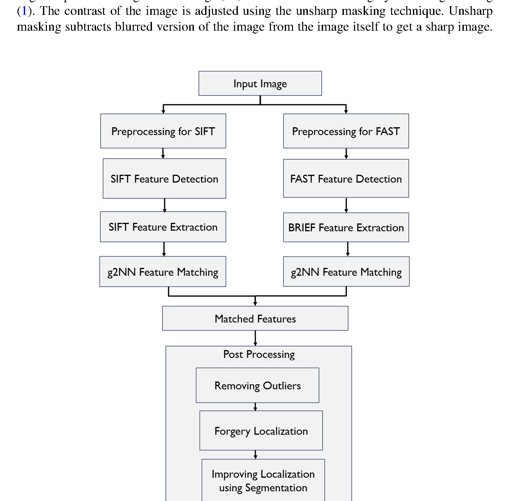

<div align="center">

# Image Copy-Move Forgery Detection
### FAST · BRIEF · SIFT

Official MATLAB implementation of our paper published in  
*Multimedia Tools and Applications* · Springer · 2022

<br/>

[](https://link.springer.com/article/10.1007/s11042-022-12915-y)
[](https://link.springer.com/content/pdf/10.1007/s11042-022-12915-y.pdf)
[](https://doi.org/10.1007/s11042-022-12915-y)
[](LICENSE)

<br/>

[LinkedIn](https://www.linkedin.com/in/baheesafatima/)
·
[ResearchGate](https://www.researchgate.net/profile/Baheesa-Fatima-2)
·
[ORCID](https://orcid.org/0009-0003-2757-5672)
·
[Email](mailto:baheesafatima@gmail.com)

</div>

---

## Overview

**Copy-move forgery** means copying a region of an image and pasting it somewhere else in the same image — often to hide or duplicate content. After rotation, scaling, or JPEG compression, these edits can be almost invisible.

This repository is the official MATLAB code for:

> Fatima, B., Ghafoor, A., Ali, S.S. & Riaz, M.M. (2022).  
> *FAST, BRIEF and SIFT based image copy-move forgery detection technique.*  
> Multimedia Tools and Applications, 81, 43805–43819.

In short, the detector:

1. finds keypoints in **smooth** areas with **SIFT**
2. finds corners in **textured** areas with **FAST + BRIEF**
3. matches duplicated regions (including **multiple pastes**) with **g2NN**
4. refines matches and **localizes** the forged region with morphology, **SSIM**, and **LSC**

- **Article:** [Springer page](https://link.springer.com/article/10.1007/s11042-022-12915-y)
- **PDF:** [Direct PDF link](https://link.springer.com/content/pdf/10.1007/s11042-022-12915-y.pdf) *(institutional / Springer access may be required)*
- **DOI:** [10.1007/s11042-022-12915-y](https://doi.org/10.1007/s11042-022-12915-y)

If this code helps your work, please [cite the paper](#citation). Thank you!

---

## Key features

| Feature | Detail |
|---|---|
| **Smooth + textured coverage** | SIFT handles low-texture regions; FAST+BRIEF recovers corners in textured areas many detectors miss |
| **Multiple pastes** | g2NN lets one keypoint match several copies — not just a single nearest neighbour |
| **Geometric attacks** | Evaluated under rotation and scaling of the copied patch |
| **Compression** | Tested with JPEG-compressed forgeries |
| **Pixel-level localization** | Outputs a forgery mask, not only a binary real/fake label |
| **Practical cost** | Avoids heavy dense-field or deep models; suitable for a standard MATLAB workstation |
| **Standard metrics** | Reports Precision, Recall, and F-measure against ground-truth masks |

---

## Method diagram

From the paper — *Fig. 1 Proposed improved copy-move image forgery detection technique*:

<div align="center">
  
</div>

### Pipeline walkthrough

| Stage | What it does |
|---|---|
| **Input image** | Forged RGB photograph |
| **SIFT branch** | Wiener / grayscale preprocess → SIFT detect & describe → g2NN match *(smooth regions)* |
| **FAST + BRIEF branch** | Sharpen / green-channel preprocess → FAST-12 corners → 256-bit BRIEF → g2NN match *(texture)* |
| **Matched features** | Union of both branches |
| **Post-processing** | Remove outliers → localize forgery → improve boundaries with **LSC** superpixels + **SSIM** check |

**Problem we target.** Classical keypoint methods often fail on smooth regions; block methods struggle with rotation/scale and cost more. We combine two complementary detectors so both textured and smooth content contribute matches, then localize with clustering rather than stopping at sparse points.

---

## Quick start

**Requirements:** MATLAB R2018b+ with the **Image Processing Toolbox**.

```bash
git clone https://github.com/baheesa/image-copy-move-forgery-detection.git
cd image-copy-move-forgery-detection
```

1. Open MATLAB in the project root.  
2. In [`main.m`](main.m), pick an image pair (defaults already point to a demo):

```matlab
img_name = 'examples/demo/img3.png';
gt_img   = 'examples/demo/img3_gt.png';
```

3. Run:

```matlab
main
```

You should see matched keypoints, correspondence lines, the final forgery overlay, and a `measure` struct with **F-measure**, **precision**, and **recall**.

More images are under [`examples/`](examples/README.md) — demo, translation, rotation, and scaling sets:

```matlab
img_name = 'examples/translation/img2.jpg';
gt_img   = 'examples/translation/img2_gt.jpg';
```

---

## Repository layout

```text
.
├── main.m                      # end-to-end script
├── FAST_12.m                   # FAST-12 corner detector
├── FAST_non_max.m              # non-maxima suppression
├── BRIEF_descriptor.m          # binary BRIEF descriptors
├── sampling_generator.m        # BRIEF sampling patterns
├── g2nn.m                      # generalized 2nd nearest neighbour
├── second_nearest_neighbour.m  # classic 2NN helper
├── dist2.m                     # pairwise squared distances
├── getFmeasure.m               # Precision / Recall / F-measure
├── LSC_mex.mexw64              # LSC localization (Windows MEX)
├── vlfeat-0.9.21/              # VLFeat (SIFT)
├── examples/                   # all demo & evaluation images
│   ├── demo/                   # 6 starter pairs
│   ├── translation/            # plain copy-move + baseline visuals
│   ├── rotation/               # rotated paste + baseline visuals
│   ├── scaling/                # scaled paste + baseline visuals
│   └── README.md
├── docs/figures/               # paper Fig. 1
├── LICENSE                     # MIT + copyright
└── README.md
```

---

## Requirements

| Dependency | Notes |
|---|---|
| **MATLAB** R2018b+ | Image Processing Toolbox (`imsharpen`, `ssim`, `regionprops`, …) |
| **VLFeat 0.9.21** | Bundled — `main.m` calls `vl_setup` automatically |
| **LSC MEX** | `LSC_mex.mexw64` is built for **64-bit Windows**. On macOS / Linux, compile [LSC](https://jschenthu.weebly.com/projects.html) (Li & Chen, CVPR 2015) for your platform and place the MEX on the MATLAB path |

---

## Default parameters

These match the settings used in our experiments / code:

| Parameter | Default | Role |
|---|---|---|
| FAST threshold γ<sub>f</sub> | `0.3` (raises to `0.5` if >15k corners) | Controls how many FAST corners are kept |
| BRIEF length | `256` | Bits per descriptor |
| BRIEF window | `11` | Local patch size |
| BRIEF pattern | `'gaussian'` | Intensity-pair sampling |
| g2NN ratio γ<sub>m</sub> | `0.05` | Distance-ratio cutoff for matching |
| LSC superpixels | `200` | Over-segmentation density |
| LSC ratio | `0.015` | Compactness / colour weight |
| Segment vote | `≥ 0.6` | Keep segments with strong match density |
| SSIM threshold γ<sub>s</sub> | `≥ 0.60` | Accept near-duplicate forged blobs |

---

## Evaluation

Detection quality is measured **pixel-wise** against a binary ground-truth mask ([`getFmeasure.m`](getFmeasure.m)):

$$
\mathrm{Precision} = \frac{\mathrm{TP}}{\mathrm{TP}+\mathrm{FP}}, \quad
\mathrm{Recall} = \frac{\mathrm{TP}}{\mathrm{TP}+\mathrm{FN}}, \quad
F = \frac{2\cdot\mathrm{TP}}{2\cdot\mathrm{TP}+\mathrm{FP}+\mathrm{FN}}
$$

The paper compares against contemporary keypoint and block-based methods on plain and attacked copy-move cases (compression, rotation, scaling, multiple pastes), reporting gains in precision, recall, F-measure, visual localization, and runtime.

---

## Examples

Everything is under [`examples/`](examples/README.md):

| Folder | Contents |
|---|---|
| `demo/` | 6 quick starter images + GT masks |
| `translation/` | Plain copy-move cases + proposed vs Pun / Ryu / Cao |
| `rotation/` | Rotated-paste cases + comparisons |
| `scaling/` | Scaled-paste cases + comparisons |

---

## Citation

```bibtex
@article{Fatima2022CopyMove,
  title   = {{FAST}, {BRIEF} and {SIFT} based image copy-move forgery detection technique},
  author  = {Fatima, Baheesa and Ghafoor, Abdul and Ali, Syed Sohaib and Riaz, M. Mohsin},
  journal = {Multimedia Tools and Applications},
  volume  = {81},
  pages   = {43805--43819},
  year    = {2022},
  doi     = {10.1007/s11042-022-12915-y},
  url     = {https://link.springer.com/article/10.1007/s11042-022-12915-y}
}
```

---

## Authors & contact

| Author | Affiliation |
|---|---|
| **Baheesa Fatima** *(corresponding)* | National University of Sciences and Technology (NUST), Islamabad, Pakistan |
| **Abdul Ghafoor** | National University of Sciences and Technology (NUST), Islamabad, Pakistan |
| **Syed Sohaib Ali** | COMSATS University, Islamabad, Pakistan |
| **M. Mohsin Riaz** | COMSATS University, Islamabad, Pakistan |

**Corresponding author — Baheesa Fatima**

- Email: [baheesafatima@gmail.com](mailto:baheesafatima@gmail.com)
- LinkedIn: [baheesafatima](https://www.linkedin.com/in/baheesafatima/)
- ResearchGate: [Baheesa-Fatima-2](https://www.researchgate.net/profile/Baheesa-Fatima-2)
- ORCID: [0009-0003-2757-5672](https://orcid.org/0009-0003-2757-5672)

---

## Publication details

| | |
|---|---|
| Journal | Multimedia Tools and Applications (Springer) |
| Received | 20 October 2020 |
| Revised | 29 July 2021 |
| Accepted | 9 March 2022 |
| Published | 27 May 2022 |
| Issue | Vol. 81, pp. 43805–43819 (December 2022) |
| Keywords | Copy-move forgery · FAST · BRIEF · SIFT · Region duplication · Tampering detection |

---

## Copyright

**© 2022 Baheesa Fatima, Abdul Ghafoor, Syed Sohaib Ali, and M. Mohsin Riaz.**

- The **source code** in this repository (MATLAB `.m` files and project scripts) is copyrighted by the authors above and released under the [MIT License](LICENSE).
- The **research article** (text, publisher-formatted PDF, and Springer layout) remains under Springer / journal copyright. Use the PDF link for reading; do not redistribute the publisher PDF as if it were open data unless Springer’s terms allow it.
- **Example images** are included for demonstration. Full benchmark datasets belong to their original creators — cite Cozzolino *et al.* (2015) and Ardizzone *et al.* (2015) when you use those sets.
- Third-party libraries (VLFeat, LSC, `dist2`) keep their own copyrights and licenses.

---

## License — why MIT?

This code is released under the **[MIT License](LICENSE)**.

We chose MIT because it is:

- **Simple** — short, widely understood, easy for universities and labs to adopt  
- **Research-friendly** — others can reuse and adapt the detector in their own pipelines  
- **Compatible** — works well alongside common open-source toolboxes  
- **Attribution-preserving** — the copyright notice must stay with the code  

MIT does **not** replace a paper citation. If you publish results that use this implementation, please cite our MTAP 2022 article (BibTeX above) and keep the copyright header.

The software is provided **as is**, without warranty.

---

## Acknowledgements

| Credit | Contribution |
|---|---|
| [**VLFeat**](http://www.vlfeat.org/) (Vedaldi & Fulkerson) | SIFT detection & description |
| **LSC** (Li & Chen, CVPR 2015) | Superpixel localization |
| **dist2** (Bishop & Nabney) | Pairwise distance routine used in matching |
| Cozzolino *et al.* (2015), Ardizzone *et al.* (2015) | Example imagery used under `examples/` |
| Springer · *Multimedia Tools and Applications* | Publishing venue |
| Anonymous reviewers | Feedback that motivated the extra rotation / scaling examples |

---

<div align="center">

<sub>
© 2022 Baheesa Fatima et al. · MIT License ·
<em>FAST, BRIEF and SIFT based image copy-move forgery detection technique</em>
</sub>

<br/><br/>

[PDF](https://link.springer.com/content/pdf/10.1007/s11042-022-12915-y.pdf)
·
[Paper](https://link.springer.com/article/10.1007/s11042-022-12915-y)
·
[Contact](mailto:baheesafatima@gmail.com)
·
[LinkedIn](https://www.linkedin.com/in/baheesafatima/)

</div>
